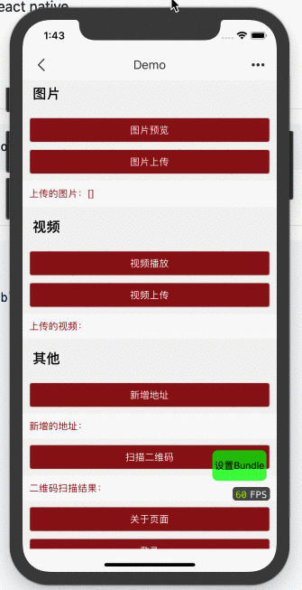

# React Native Refresh Control View


Let you have ability to customize refresh control.

**NOT READY YET**



## Install

```bash
  # peer dependency
  yarn add react-native-gesture-handler
  yarn add react-native-customizable-refresh-control-view
```

## Usage

```jsx
import React from 'react';
import { Text } from 'react-native';
import { ScrollView } from 'react-native-customizable-refresh-control-view';

class RefreshControl extends React.Component {
  render() {
    return <Text>Refreshing...</Text>;
  }
}

class ReactComponent extends React.Component {
  handlePullRefresh = () => {
    // refreshing, you can return promise here.
  };

  render() {
    return (
      <ScrollView
        onPullRefresh={this.handlePullRefresh}
        minRefreshDistance={100}
        RefreshControl={RefreshControl}
      >
        ...content
      </ScrollView>
    );
  }
}
```
